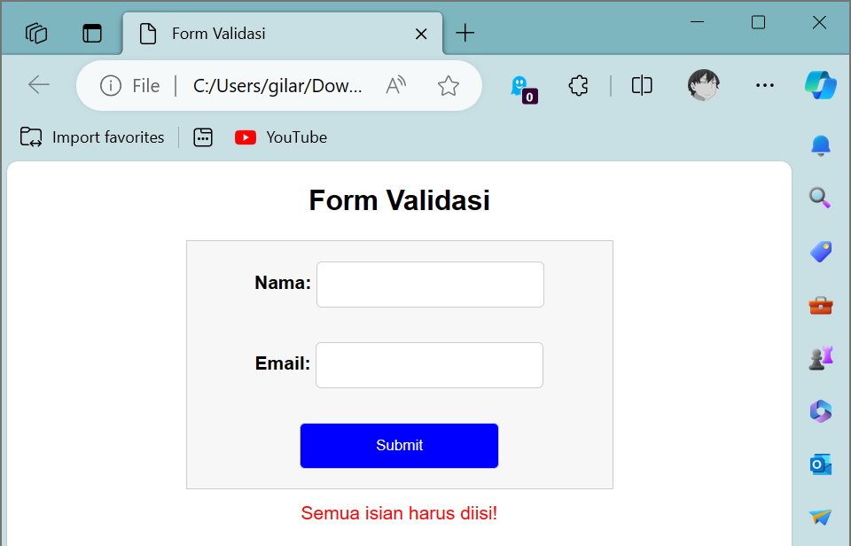

# Lab5Web + Javascript
## Profil
| Variable | Isi |
| -------- | --- |
| **Nama** | Gilar Sumilar |
| **NIM** | 312210407 |
| **Kelas** | TI.22.A4 |
| **Mata Kuliah** | Pemrograman WEB |

### Instruksi Praktikum
1. Persiapkan text editor misalnya VSCode.
2. Buat folder baru dengan nama lab5_javascript.
3. Ikuti langkah-langkah praktikum yang akan dijelaskan berikutnya.
4. Lakukan validasi dokumen html dengan mengakses http://validator.w3.org

### Pertanyaan dan Tugas
1. Buat script untuk melakukan validasi pada isian form

### Jawaban
[Sourcecode](https://github.com/GilarSumilar/Lab5Web/blob/main/Gambar/Tugas.png)

**Hasil tugas :**

 

